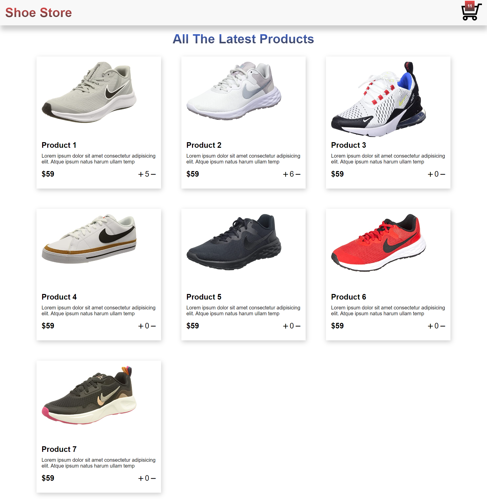
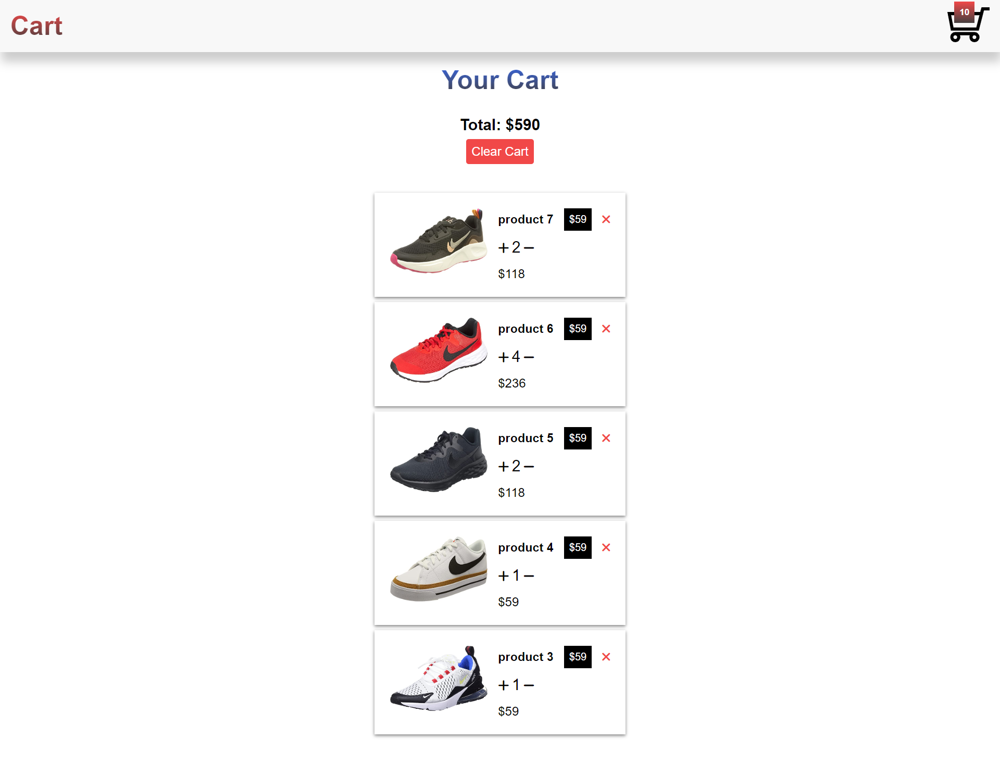

### shopping-cart-react-local-storage

An application used to buy and add item to the shopping cart based on local data and then calculates items price with the provided amount built with React, context api,React router, React tooltip , JavaScript, and CSS.

### Project Screen Shot(s)

Clone down this repository. You will need node and npm installed globally on your machine.
### Installation and Setup Instructions
### `npm install`

and then

### `npm start`

Runs the app in the development mode.\
Open [http://localhost:3000](http://localhost:3000) to view it in your browser.
